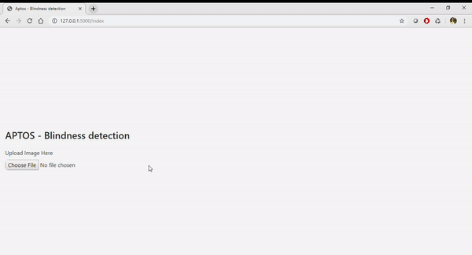

Install following packages:
 conda install pytorch torchvision cudatoolkit=10.1 -c pytorch
 conda install fastai pytorch=1.0.0 -c fastai -c pytorch -c conda-forge
 pip install zappa
 pip install -r requirement.txt

 This web application is to predict the presence of diabetic retinopathy in each image on a scale of 0 to 4. According to the following scale:
    <ul>
        <li>0 - No DR</li>
        <li>1 - Mild</li>
        <li>2 - Moderate</li>
        <li>3 - Severe</li>
        <li>4 - Proliferative DR</li>
    </ul>

I have used fastai transfer learning to make use of resent50 model trained over imagenet. I have also made use of 1Cycle policy to train the data on APTOS dataset
  

Thanking everyone whose kernels and blogs were referenced while building this model

